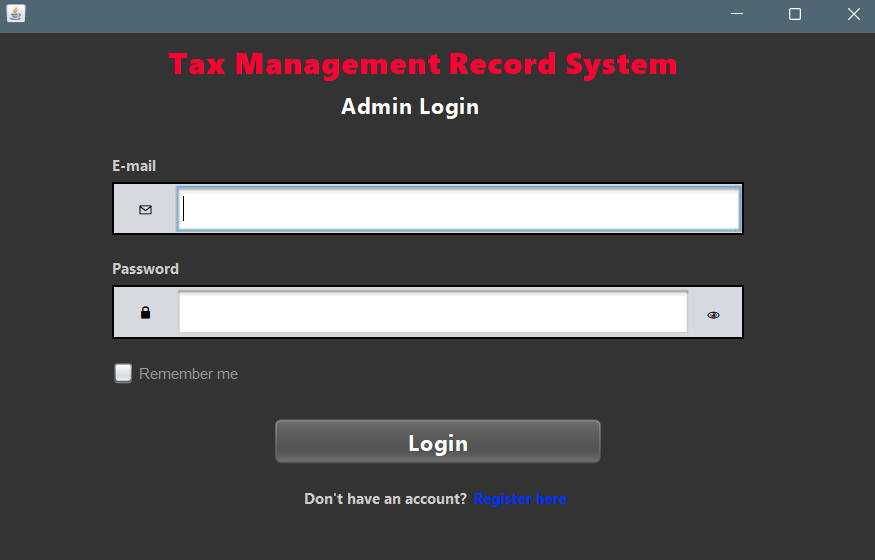
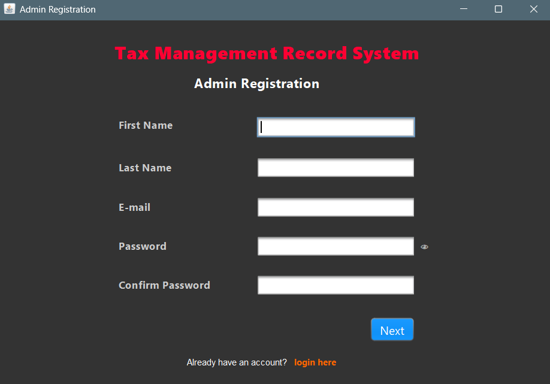
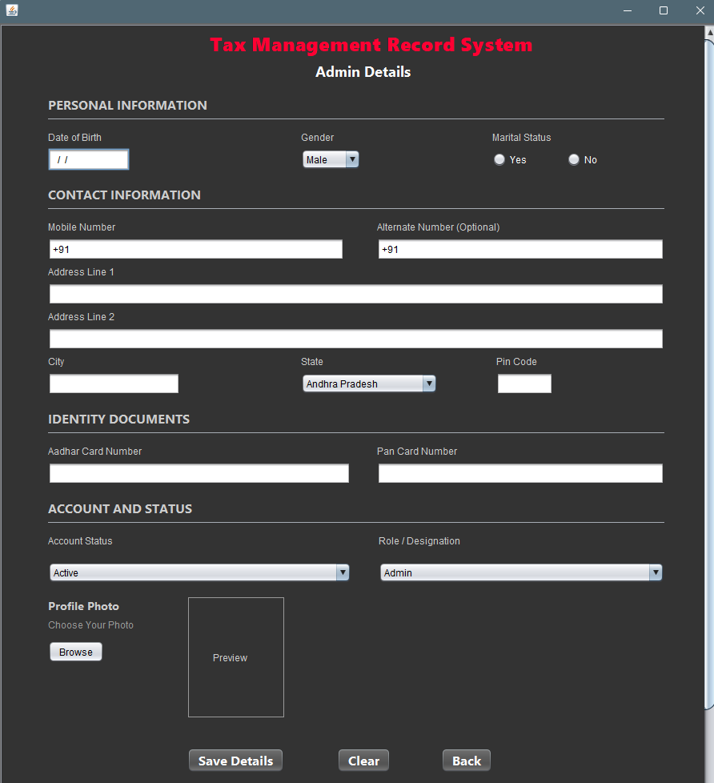
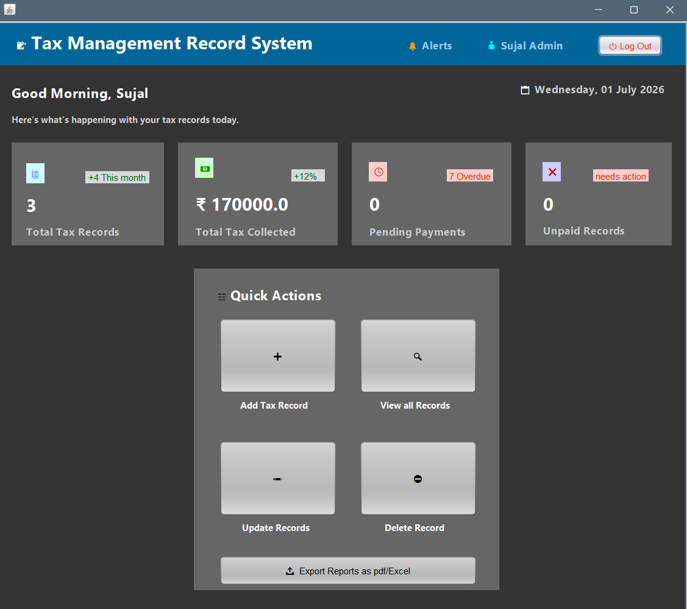
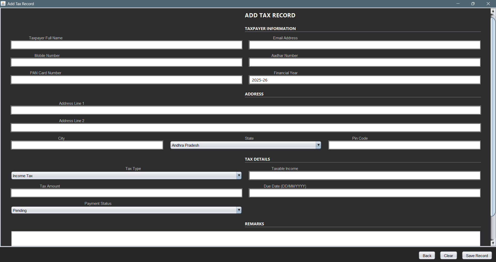
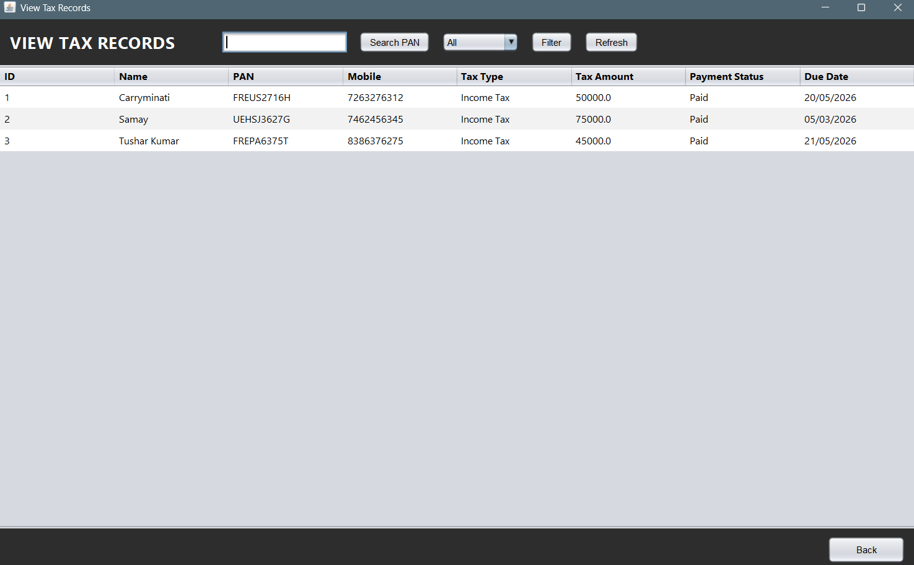
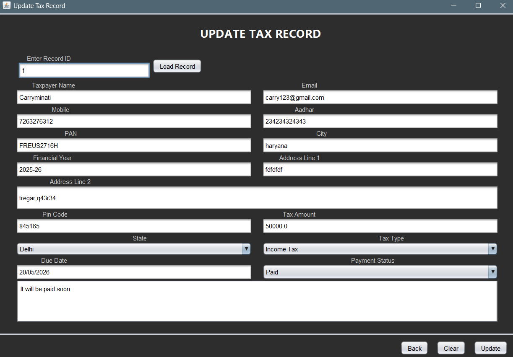
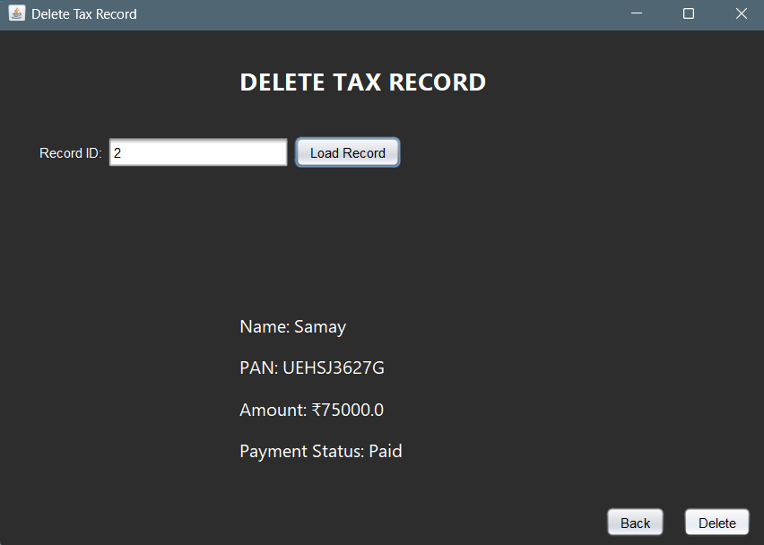

# Tax Record Management (TRM) System

🔗 **[Live Demo](https://sujalashish.github.io/Tax-Record-Management/)**

TRM is a Java Swing enterprise desktop application designed for secure, efficient tax record tracking and management. Built on a modular **DAO (Data Access Object)** architecture, the system provides administrators with a complete CRUD (Create, Read, Update, Delete) interface to organize taxpayer profiles, track payment statuses, and export reports directly to local CSV files.

---

## 🚀 Core Features

*   **Administrator Access Control:** Secure user registration, authentication (`LoginForm`, `RegisterForm`), and detail checks (`AdminDetailsForm`) connecting to a relational database.
*   **Complete Profile Management:** Standard CRUD capabilities (`AddTaxRecordForm`, `UpdateTaxRecordForm`, `DeleteTaxRecord`, `ViewTaxRecords`) with input validations for PAN formats, phone lengths, and tax amounts.
*   **Database Transaction Safety:** Implements Java Database Connectivity (JDBC) queries and SQL bindings to ensure accurate ledger operations.
*   **Native CSV Exporter:** Includes a modular data export engine (`ExportData.java`) that prompts users to save a clean, formatted CSV document directly to their local filesystem using a Swing `JFileChooser`.

---

## 🛠️ Technology Stack

*   **Platform Language:** Java (Release 26 Compiler)
*   **GUI Framework:** Java Swing & AWT (NetBeans Form Designer)
*   **Relational Database:** MySQL Server
*   **Build System:** Apache Maven (pom.xml configuration)
*   **JDBC Connector:** MySQL Connector/J (v9.7.0)

---

## 📂 Project Architecture

The codebase follows standard MVC-style boundaries to isolate GUI elements from data management:

```
src/main/java/
├── config/
│   └── DBConnection.java       # Manages MySQL Connection Pools
├── model/
│   ├── Admin.java              # Admin account properties mapping
│   └── TaxRecord.java          # Taxpayer record properties mapping
├── dao/
│   ├── AdminDAO.java           # DB transactions for Auth logic
│   └── TaxRecordDAO.java       # DB transactions for CRUD operations
└── ui/
    ├── Dashboard.java          # Main window and controls layout
    ├── auth/
    │   ├── LoginForm.java      # Login panel and credentials verify
    │   ├── RegisterForm.java   # New account signup forms
    │   └── AdminDetailsForm.java # Detail checks profile view
    └── tax/
        ├── AddTaxRecordForm.java # Record registration GUI
        ├── UpdateTaxRecordForm.java # Records update form
        ├── DeleteTaxRecord.java     # Safe records deletion prompt
        ├── ViewTaxRecords.java      # Tabular grid panel for record lists
        └── ExportData.java          # CSV conversion and saving logic
```

---

## 💻 Setup & Installation Guide

### 1. Prerequisites
Ensure you have the following installed on your machine:
*   Java Development Kit (JDK) 26 or higher
*   Apache Maven
*   MySQL Database Server

### 2. Database Initialization
Create a MySQL schema and run the required tables configuration:
```sql
CREATE DATABASE trm_db;
USE trm_db;

-- Admin accounts table
CREATE TABLE admins (
    id INT AUTO_INCREMENT PRIMARY KEY,
    username VARCHAR(50) NOT NULL UNIQUE,
    password VARCHAR(255) NOT NULL,
    email VARCHAR(100) NOT NULL,
    mobile VARCHAR(15)
);

-- Taxpayers records table
CREATE TABLE tax_records (
    id INT AUTO_INCREMENT PRIMARY KEY,
    taxpayer_name VARCHAR(100) NOT NULL,
    pan VARCHAR(10) NOT NULL UNIQUE,
    mobile VARCHAR(15),
    tax_type VARCHAR(50) NOT NULL,
    tax_amount DECIMAL(15, 2) NOT NULL,
    payment_status VARCHAR(20) DEFAULT 'Pending',
    due_date DATE
);
```

### 3. Connection Settings
Configure your MySQL database username and password in the database config class:
*   File Location: [DBConnection.java](file:///C:/Users/Acer/OneDrive/Documents/NetBeansProjects/TRM_Sujal/src/main/java/config/DBConnection.java)
```java
// Update credentials inside config package
private static final String URL = "jdbc:mysql://localhost:3306/trm_db";
private static final String USER = "your_mysql_username";
private static final String PASSWORD = "your_mysql_password";
```

### 4. Build and Launch
Navigate to the root directory and execute the following Maven build scripts:
```bash
# Clean project and compile java files
mvn clean compile

# Run the swing application
mvn exec:java
```

---

## 🖼️ Application Interfaces (Screenshots)

### 1. Login & Signup Forms
| Sign In Interface | Registration Interface | Admin Profile View |
| :---: | :---: | :---: |
|  |  |  |

### 2. Main Dashboard & Record Operations
| Management Dashboard | Add Record Interface |
| :---: | :---: |
|  |  |

### 3. Record Management & Data Operations
| View Records | Update Record | Delete Record |
| :---: | :---: | :---: |
|  |  |  |

